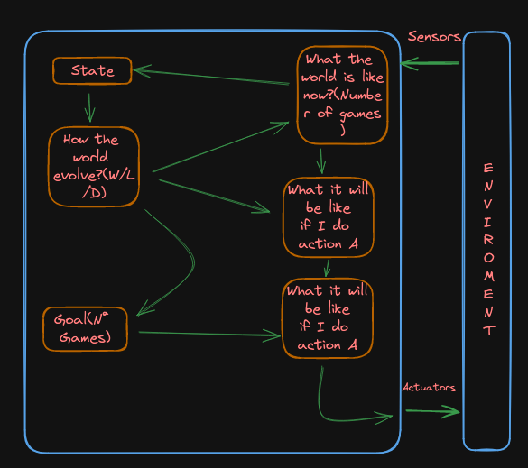

# ROCK-PAPER-SCISSORS
Practice 1 // AI and Big Data course-IES de Teis

# Características del Agente
Partially Observable / Multi Agent / Stochastic / Episodic / Static / Discrete 

# Modelo del Agente

