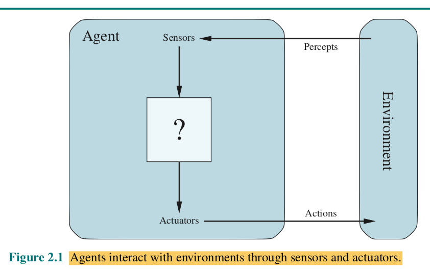

# ROCK-PAPER-SCISSORS
Practice 1 // AI and Big Data course-IES de Teis

Diego Pereiro Martinez Sayanes

# Guia ReadMe original
=============================

   * [O problema](#o-problema)
   * [Contorno de tarefas](#tcontorno-de-tarefas)
   * [Estrutura do axente](#estrutura-do-axente)
   * [Implementación](#implementación)
   * [Extensión](#extensión)
   * [Entrega](#entrega)
   * [Bibliografía](#bibliografía)

Proponse programar un axente intelixente solución ao entorno de tarefas do xogo pedra, papel, tesoiras, seguindo as directrices de modelado propostas no capítulo 2 _Intelligent Agents_ do libro _IA: A modern approach, Russell & Norvig_.

Para iso é necesario:

1. Especificar as características do contorno de tarefas.
2. Identificar o tipo de axente para determinar a estrutura do axente.
3. Implementar en Python os compoñentes da estrutura do axente para construir a función axente ou función mapa.

## O problema

Estudia a [solución básica](./doc/codigo_RPS_explicado.md) ao xogo pedra, papel, tesoiras (desde agora RPS, siglas en inglés correspondentes a _Rock, Paper, Scissors_).

Intenta comprender os constructos Python que se empregan.

## Contorno de tarefas

Especifica as características do contorno de tarefas do RPS e xustifica a túa resposta, segundo o epígrafe _"2.3.2 Properties of task environments"_ do capítulo 2 _Intelligent Agents_ do libro _IA: A modern approach, Russell & Norvig_.

Resume as características do contorno nunha táboa co formato:

Contorno de tarefas | Observable| Axentes | Determinista | Episódico | Estático | Discreto | Coñecido
:---: | :---: | :---: | :---: | :---: | :---: | :---: | :---: |
 RPS | Partially Observable  | Multi Agent | Stochastic | Episodic | Static  |  Discrete |  - |

No libro atoparás unha táboa semellante:

Exemplos contornas de tarefas.

## Estrutura do axente

O noso propósito é deseñar o **programa axente** que implementa a **función axente** ou a **función que mapea** as percepcións a accións. 

A partires do modelo xeral de axente intelixente da figura:

**debuxa un modelo adecuado** ao contorno de tarefas e a un dos catro **tipos de programas axente**:

El modelo de este agente sería Model-Based  agent ya que el Agente Inteligente tiene un historial de las partidas que ha ido jugando y el comportamiento del robot no cambia dependiendo de la distancia que haya hasta su objetivo. El programa sigue las normas básicas del juego RPS.

- Axentes reactivos simples
- Axentes reactivos baseados en modelos.
- Axentes baseados en obxectivos.
- Axentes baseados en utilidade.

Cada clase de axente combina compoñentes particulares dun modo particular para xerar as accións. 

## Implementación - Simulando IA

Implementa en Python os compoñentes da estrutura do axente para construir a función axente ou función mapa.

Lee o código contigo en [src](./src/) e os [comentarios ao código](./doc/codigo_RPS_explicado.md).

Modifica a función `get_computer_action()` coa estratexia que consideres máis proveitosa para maximizar o **rendemento** do axente. Recorda que a medida do rendemento vese afectada por diversas consideracións.

Engade os compoñentes software que precises para implementar os compoñentes do tipo de programa axente que deseñaches no epígrafe anterior que, de xeito xeral, se incluen na figura seguinte:

Consegue que o código satisfaga os principios **SOLID**, en particular, **SRP** e **OCP** para extender a súa lóxica a diferentes versións do xogo.

Para programar la estrategia de este agente se han añadido dos clases diferentes con dos tipos de estrategias diferentes una estrategia principal y otra random. Se puede jugar contra una o la otra dependiendo de la decision del usuario.
Para controlar la lógica de victoria, derrota o empate se utiliza la función asses_game la cual ha sido modificada para mejorar la mantenibilidad del código. Así si se necesitan meter mas movimientos o jugadas se tiene que añadir código en vez de cambiarlo.

Asses_game_silent sirve para determinar si el usuario gana o no y poder usarla en la clase estrategia principal.

Se creo una función get_game_count para regcoger le número de rondas que se van a  jugar una vez se llega el programa pregunta si se quiere jugar una ronda más.

Se llevo acabo un control de errores en todas las interaciones del usuario en las que escribe una orden, así si este introduce un parámetro que no está recogido por el agente le hará al usuario volver a introducirlo.

En el RPSL se edito el diccionario Victories para recoger las condiciones de victoria de los nuevos movimientos.
Se creo una clase game para mejorar la mantenibilidad también, está clase engloba las funciones asses_game y asses_game_silent.
En la clase EstrategiaPrincipal se cambio parte del código para facilitar la implementación de los nuevos movimientos. Ahora a traves de Victories se accede a las keys que serían el número de jugadas posibles.

La estrategia del RPS:

Se guardan los movimientos tanto del usuario como de la máquina en una lista.

Primer movimiento tiene que ser random

En el caso de que pierda el programa. El programa sacara lo que gane al resultado con el que ha perdido:

Rondas posibles: Papel>Piedra --->Programa sacara en la siguiente ronda Tijeras Piedra>Tijeras -->Programa sacara en la siguiente ronda Papel Tijeras>Papel --> Programa sacara en la siguiente ronda Piedra

En caso de perder dos o más veces seguidas. El programa deberá sacar el resultado con el que todavía no ha perdido.

En el caso de que gané el programa. En la siguiente ronda el programa sacará con lo que ha perdido el contrincante

En el caso de ganar 2 partidas seguidas deberá sacar el resultado con el que ha ganado la partida anterior.

En caso de empate. El programa sacará un resultado random. Entre los dos resultados que quedan sin sacar.

La estrategia del RPSL:
Sería la misma que segui en el RPS.

## Extensión

Unha vez programado o axente para a versión clásica do RPS, extende o súa lóxica para xogar á versión  [pedra, papel, tesoiras, lagarto, Spock](http://www.samkass.com/theories/RPSSL.html)

## Entrega

Nun proxecto no teu github /gitlab co teu código e a documentación, esta última recollida no `README` do proxecto e escrita en formato Markdown.

## Bibliografía

Lutz, Mark. _Learning Python_. Sebastopol, Ca, O’reilly, 2018.

Martin, Robert C. _Clean Code a Handbook of Agile Software Craftmanship_. Upper Saddle River [Etc.] Prentice Hall, 2010.

Martin, Robert C. _Clean Architecture: A Craftsman’s Guide to Software Structure and Design_. Prentice Hall, 2018.

S. McConnel. _Code Complete: A Practical Handbook of Software Construction_, 2dn Edition. Microsoft Press, 2004.

Russell, Peter. _ARTIFICIAL INTELLIGENCE : A Modern Approach_, Global Edition. S.L., Pearson Education Limited, 2021.

